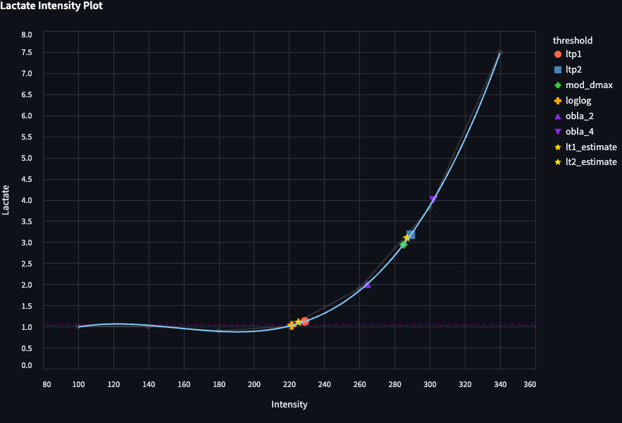
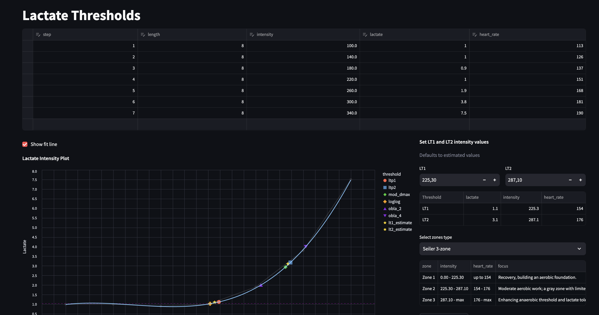

# lactate_thresholds

A Python package to analyze lactate values and corresponding thresholds. Typically useful in a context when used to determine workout zones.

## Installation

```shell
pip install lactate_thresholds
# OR
uv add lactate_thresholds
# OR 
# install command for whatever package manager you use
```

## Basic usage

You will need a dataframe that holds your measurement values. Let's start by importing an example dataframe.

```python
import lactate_thresholds as lt
from lactate_thresholds.data import example_data_cycling

df = example_data_cycling()
df
```

```shell
   step  length  intensity  rel_power  heart_rate  lactate_4  lactate_8  cadence  rpe
0     1       8        100        1.3         113        1.0        1.0      102    6
1     2       8        140        1.8         126        1.0        1.0      100    7
2     3       8        180        2.3         137        0.9        0.9      100   10
3     4       8        220        2.8         151        1.0        1.0       98   12
4     5       8        260        3.3         168        1.9        1.9       98   16
5     6       8        300        3.8         181        3.3        3.8       94   18
6     7       8        340        4.3         190        6.4        7.5       92   19
```

Note that the only cols required are `step`, `length`, `intensity`, `heart_rate` and `lactate`.
If your columns are not correctly named (in this example the `lactate` column is missing), you can specify the correct name in the following steps.


```python 
results = lt.determine(df, lactate_col='lactate_8')
```

The above `determine` function is a convenience function that runs (in the following order):
- `lactate_thresholds.clean_data(df)`
- `lactate_thresholds.interpolate(df_clean)`
- `lactate_thresholds.methods.determine_ltp(df_clean, df_interpolated)`
- `lactate_thresholds.methods.determine_mod_dmax(df_clean, df_interpolated)`
- `lactate_thresholds.methods.determine_loglog(df_clean, df_interpolated)`
- `lactate_thresholds.methods.determine_obla(df_interpolated, 2)`
- `lactate_thresholds.methods.determine_obla(df_interpolated, 4)`
- `lactate_thresholds.methods.determine_baseline(df_clean, df_interpolated, 0)`
- `lactate_thresholds.types.LactateThresholdResults.calc_lt1_lt2_estimates()`


The returned object is an instance of `LactateThresholdResults` which looks more or less like:

```python
class LactateThresholdResults(BaseModel):
    clean_data: pd.DataFrame
    interpolated_data: pd.DataFrame
    ltp1: LactateTurningPoint | None = None
    ltp2: LactateTurningPoint | None = None
    mod_dmax: ModDMax | None = None
    loglog: LogLog | None = None
    baseline: BaseLinePlus | None = None
    obla_2: OBLA | None = None
    obla_4: OBLA | None = None
    lt1_estimate: ThresholdEstimate | None = None
    lt2_estimate: ThresholdEstimate | None = None
```

## Plotting

Some basic plotting functionalities implemented in Altair are present, most notably:
* `lactate_thresholds.plot.lactate_intensity_plot` 
* `lactate_thresholds.plot.heart_rate_intensity_plot` 

For example:



## Zone calculation

Basic zone calculations (yet to be verified) are available at:
* `lactate_thresholds.zones.seiler_3_zones` 
* `lactate_thresholds.zones.seiler_5_zones` 
* `lactate_thresholds.zones.friel_7_zones_running` 


## Streamlit app

There is a minimal streamlit app built in that you can use to interactively analyse your data.

The app is available through a `script`. Run it as follows (to be tested after first deploy to pypi):

```shell 
pipx install lactate_thresholds
lt_app

# OR
uv tool install lactate_thresholds
lt_app
```


